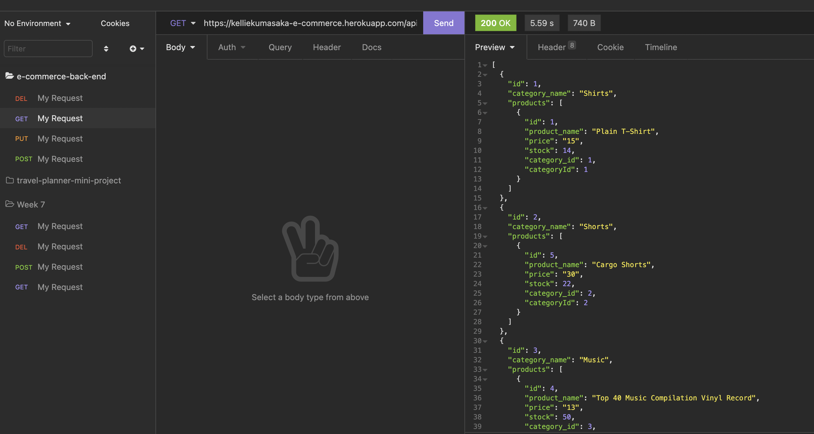
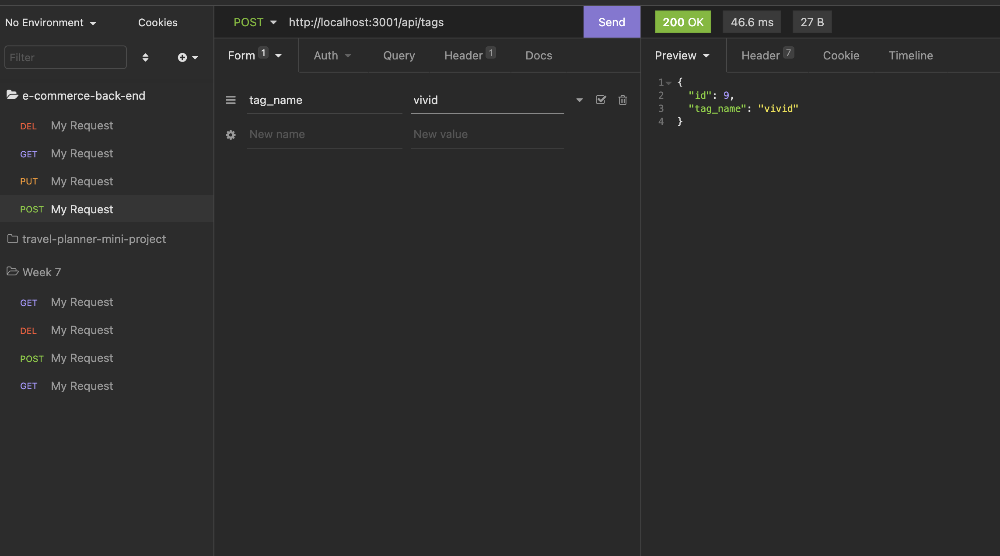
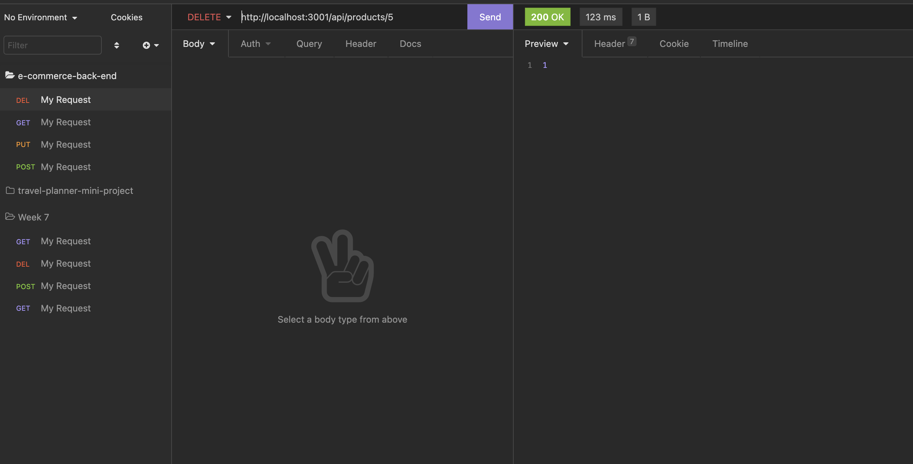

# E-Commerce Back End 
## Description
In this deployed application, the user is able to log products and view categories of these products, as well as their tags. When the user makes a post request, they can add to the products, categories, and tags, as well as view them using a get request. The user can also make put requests for the products and delete whichever product, category, or tag they'd like. The purpose of this application is make it easy for a user to track their products, categories, and tags for their online store.

Please view deployed site [here](https://kelliekumasaka-e-commerce.herokuapp.com/).

When you run a `GET` request with the url/api/:yourCategory on Insomnia, you are presented with data from the api seeded data.

To create a new entry, use the `POST` request and, using the correct variables, enter a new product, category, or tag.

If you need to update a product, category, or tag, use a `PUT` request to the url/api/:yourCategory/:id, the id being the one of that which you'd like to update.

![successful put request for category with the id of 3 to category_name of sweatpants. There is a [ 1 ] indicating that there was 1 entry updated](./images/put.png)

Lastly, to delete an entry, go to the corresponding url/api/:yourCategory/:id and send a `DELETE` request. The entry with the id in the category that you entered into the URL will be deleted.

## Table of Contents
* [Installation](#installation)
* [Usage](#usage)
* [Contributing](#contributing)
* [Tests](#tests)
* [License](#license)
* [Questions](#questions)

## Installation
Run `npm i` to install `express`, `dotenv`, `mysql2`, and `sequelize`.

## Usage
This app must be run on a server an using an app such as Insomnia or Postman to create `POST` and `PUT` requests.

## Contributing

## Tests

## License
This project is licensed under MIT.

## Questions
Here is a link to my [GitHub](https://github.com/kelliekumasaka) or shoot me an [email](mailto:kelliek3@uw.edu).
